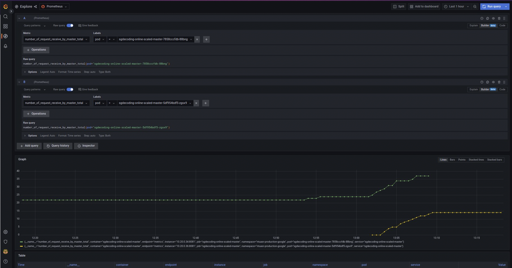

# Guide to set up ntuasr-application

## GHCR Set Up
1. Build the image in your local machine `docker build -t ntu-asr-image .`
2. Tag the image `docker tag ntu-asr-image ghcr.io/kaikiat/ntu-asr-image:latest`
3. Create a personal access token for ghcr. Refer to [link](https://docs.github.com/en/packages/working-with-a-github-packages-registry/working-with-the-container-registry#authenticating-to-the-container-registry)
4. Store this token as CR_PAT 
5. Push to ghcr using `docker push ghcr.io/kaikiat/ntu-asr-image:latest`
6. The image should appear at `https://github.com/kaikiat?tab=packages`

## Google Set Up - Terraform
1. Create a project in gcp 
2. Enable billing and add a billing account
3. Create a gcs bucket `tf-state-prod-12`. Create a folder called `terraform` and another inner folder called `state`
```
terraform {
  backend "gcs" {
    bucket  = "tf-state-prod-12"
    prefix  = "terraform/state"
  }
}
```
4. Run `gcloud auth login` 
5. Set project id using `export PROJECT_ID=your-project-id`
6. Provision gcp resources using Terraform
```
# Terraform will set up application resources
cd Terraform_google || exit
terraform init
terraform validate
terraform plan
terraform apply -auto-approve
```
7. Set up iam roles
```
gcloud iam roles create Terraform_role \
  --file=Terraform_role.yaml \
  --project $PROJECT_ID
```
8. Bind policies
```
gcloud projects add-iam-policy-binding $PROJECT_ID \
    --member="serviceAccount:terraform-sa@${PROJECT_ID}.iam.gserviceaccount.com" \
    --role="projects/${PROJECT_ID}/roles/Terraform_role"
```

## Google Set Up - Filestore 

1. Upload model to Google File Store
 - Go to Gcloud console **Compute Engine > VM instances** and click one of the VMs
 - Get the code to ssh to the VM
 - ssh to the VM using a new terminal window
 - Run the following to mount the filestore onto the VM
``` 
 mkdir mnt 
 sudo mount <filstore ip>:/<filestore path> <mount directory>
 # Example: sudo mount 10.179.74.18:/modelshare mnt
 sudo chmod go+rw mnt
 pwd
```
 - Keep the output from the pwd command
 - Upload the models by running the following in our project root directory:
```
gcloud compute scp models/SingaporeCS_0519NNET3 <VM_ID>:<output_from_pwd> --project=<PROJECT_ID> --zone=asia-southeast1-a --recurse
gcloud compute scp models/SingaporeMandarin_0519NNET3 <VM_ID>:<output_from_pwd> --project=<PROJECT_ID> --zone=asia-southeast1-a --recurse
# Example:
gcloud compute scp models/SingaporeCS_0519NNET3 gke-gke-ntu-asr-clus-ntu-asr-node-poo-3196fc90-f9l9:/home/kaikiat/mnt --project=cube-11 --zone=asia-southeast1-a --recurse
 ```

 > Note: VM_ID looks something like this gke-gke-ntu-asr-clus-ntu-asr-node-poo-5a093a1f-fcd2


## Google Set Up - GKE Cluster
1. Create a namespace 
```
export KUBE_NAME=sgdecoding-online-scaled
export NAMESPACE=ntuasr-production-google
gcloud container clusters get-credentials gke-ntu-asr-cluster --zone asia-southeast1-a --project $PROJECT_ID
kubectl create namespace $NAMESPACE
kubectl config set-context --current --namespace $NAMESPACE
```
2. Apply the secrets.yaml and the pv claims. Note: Remember to change the IP address of the file store. Now run 
```
kubectl apply -f google_production/secret/run_kubernetes_secret.yaml
kubectl apply -f google_production/google_pv/  # need to change the ip address of the pvc, need to delete pv when rerunning
```
3. Create docker secrets
```
kubectl create secret docker-registry regcred --docker-server=ghcr.io --docker-username=$GITHUB_USERNAME --docker-password=$CR_PAT --docker-email=$GITHUB_EMAIL --namespace $NAMESPACE
kubectl create secret docker-registry regcred2 --docker-server=registry.gitlab.com --docker-username=$GITLAB_USERNAME --docker-password=$GITLAB_PASSWORD --docker-email=$GITLAB_EMAIL --namespace $NAMESPACE
```
## Argo CD Set Up
1. Install argocd `brew install argocd`
2. Create argocd namespace `kubectl create namespace argocd`
3. Apply manifests files `kubectl apply -n argocd -f https://raw.githubusercontent.com/argoproj/argo-cd/stable/manifests/install.yaml`
4. Port-forward argocd-server using `kubectl port-forward svc/argocd-server -n argocd 8080:443` in another terminal tab.
5. Login through the UI. Password can be obtained from `kubectl -n argocd get secret argocd-initial-admin-secret -o jsonpath="{.data.password}" | base64 -d; echo`, the username is `admin`.
6. Login via cli using `argocd login localhost:8080 --username admin --password $(kubectl -n argocd get secret argocd-initial-admin-secret -o jsonpath="{.data.password}" | base64 -d)`
7. Add github ssh key. Refer to github docs if ssh key has not be generated, otherwise run `argocd repo add git@github.com:kaikiat/fyp-cd.git --ssh-private-key-path ~/.ssh/id_rsa`. This can be intepreted as `argocd repo add GITHUB_SSH_URL  --ssh-private-key-path /path/to/ssh/key`, this command with add a github repository to argocd.
8. Verify using `argocd repo list`
9. Apply the manifests file using `kubectl apply -f application.yaml`

## Argo Notifications Set Up
1. Install argo cd notifications `kubectl apply -n argocd -f https://raw.githubusercontent.com/argoproj-labs/argocd-notifications/release-1.0/manifests/install.yaml`
2. Setup SMTP server + Slack app beforehand.
3. Add config.yaml which contains the credentials for SMTP server as well as Slack app. `kubectl apply -n argocd -f config.yaml`
4. Patch the app using
```
# Slack Email
kubectl patch app sgdecoding-online-scaled -n argocd -p '{"metadata": {"annotations": {"notifications.argoproj.io/subscribe.on-sync-succeeded.slack":"#argocd"}}}' --type merge
kubectl patch app sgdecoding-online-scaled -n argocd -p '{"metadata": {"annotations": {"notifications.argoproj.io/subscribe.on-sync-status-unknown.slack":"#argocd"}}}' --type merge
kubectl patch app sgdecoding-online-scaled -n argocd -p '{"metadata": {"annotations": {"notifications.argoproj.io/subscribe.on-sync-failed.slack":"#argocd"}}}' --type merge
kubectl patch app sgdecoding-online-scaled -n argocd -p '{"metadata": {"annotations": {"notifications.argoproj.io/subscribe.on-health-degraded.slack":"#argocd"}}}' --type merge

# SMTP Email
kubectl patch app sgdecoding-online-scaled -n argocd -p '{"metadata": {"annotations": {"recipients.argocd-notifications.argoproj.io":"kaikiatpoh14@gmail.com"}}}' --type merge
kubectl patch app sgdecoding-online-scaled -n argocd -p '{"metadata": {"annotations": {"notifications.argoproj.io/subscribe.on-sync-succeeded.gmail":"kaikiatpoh14@gmail.com"}}}' --type merge
kubectl patch app sgdecoding-online-scaled -n argocd -p '{"metadata": {"annotations": {"notifications.argoproj.io/subscribe.on-sync-failed.gmail":"kaikiatpoh14@gmail.com"}}}' --type merge
kubectl patch app sgdecoding-online-scaled -n argocd -p '{"metadata": {"annotations": {"notifications.argoproj.io/subscribe.on-sync-status-unknown.gmail":"kaikiatpoh14@gmail.com"}}}' --type merge
kubectl patch app sgdecoding-online-scaled -n argocd -p '{"metadata": {"annotations": {"notifications.argoproj.io/subscribe.on-health-degraded.gmail":"kaikiatpoh14@gmail.com"}}}' --type merge
kubectl patch app sgdecoding-online-scaled -n argocd -p '{"metadata": {"annotations": {"notifications.argoproj.io/subscribe.on-deployed.gmail":"kaikiatpoh14@gmail.com"}}}' --type merge
kubectl patch app sgdecoding-online-scaled -n argocd -p '{"metadata": {"annotations": {"notifications.argoproj.io/subscribe.on-sync-running.gmail":"kaikiatpoh14@gmail.com"}}}' --type merge
``` 
5. By this time, you should also have received an notification from the SMTP server that the application has successfully sync.

## Argo Rollouts Setup
1. Install rollouts plugin using 
```
curl -LO https://github.com/argoproj/argo-rollouts/releases/latest/download/kubectl-argo-rollouts-darwin-amd64
chmod +x ./kubectl-argo-rollouts-darwin-amd64
sudo mv ./kubectl-argo-rollouts-darwin-amd64 /usr/local/bin/kubectl-argo-rollouts
```
2. Create namespace `kubectl create namespace argo-rollouts`

## Prometheus Installation
1. Run the following commands
```
kubectl create namespace prometheus
helm repo add prometheus-community https://prometheus-community.github.io/helm-charts
helm install prometheus prometheus-community/kube-prometheus-stack --namespace prometheus
```
2. Port forward Prometheus and Grafana
```
kubectl port-forward service/prometheus-kube-prometheus-prometheus 9090 -n prometheus
kubectl port-forward deployment/prometheus-grafana 3000 -n prometheus
```
3. Install service monitor for argo cd `kubectl apply -f prometheus_configuration/service-monitor.yaml -n argocd`
4. Install service monitor for ntuasr application `kubectl apply -f prometheus_configuration/service-monitor-ntuasr.yaml -n ntuasr-production-google`
5. Only after completing step 1-3, then you can install argo rollouts.

## Argo Rollouts Installation
1. Install argo rollouts with helm `helm install argo-rollouts argo_rollouts --namespace argo-rollouts`
2. Install service monitor for argo rollouts `kubectl apply -f prometheus_configuration/service-monitor-argorollouts.yaml -n argo-rollouts`, after installing helm.
3. Verify that rollout is working by running `kubectl argo rollouts dashboard` to open the rollout web ui.
4. Alternative verify the app using `python3 client/client_3_ssl.py -u ws://$MASTER_SERVICE_IP/client/ws/speech -r 32000 -t abc --model="SingaporeCS_0519NNET3" client/audio/episode-1-introduction-and-origins.wav`

## Grafana Dashboard Set Up
1. Go to `http://localhost:3000/login` to view the Grafana Web UI. The username is `admin`, the password is `prom-operator`
2. Go to `Dashboard` > `Import` > `Upload JSON file`. Add 2 files `prometheus_configuration/argocd-dashboard.json` and `prometheus_configuration/argorollout-dashboard.json`.

## Canary Rollouts
1. Refer to manifest file in  `canary/rollout/google_deployment_helm/helm/sgdecoding-online-scaled`
2. Change the image in the values.yaml and commit to the main branch
3. Run the folllowing commands to view the logs
```
# Original Master Pod
NAMESPACE=ntuasr-production-google && \
WORKER=$(kubectl get pods --sort-by=.metadata.creationTimestamp -o jsonpath="{.items[0].metadata.name}" -n $NAMESPACE) && \
kubectl logs $WORKER -f -n $NAMESPACE

# Preview Master Pod
NAMESPACE=ntuasr-production-google && \
WORKER=$(kubectl get pods --sort-by=.metadata.creationTimestamp -o jsonpath="{.items[2].metadata.name}" -n $NAMESPACE) && \
kubectl logs $WORKER -f -n $NAMESPACE
```

## BlueGreen Rollouts
1. Refer to manifest file in  `blue_green/rollout/google_deployment_helm/helm/sgdecoding-online-scaled`
2. Change the image in the values.yaml and commit to the main branch

## Promethues and Grafana in-depth
1. Go to `Explore` in the Grafana UI.
2. Input the following parameters as seen in the figure below

